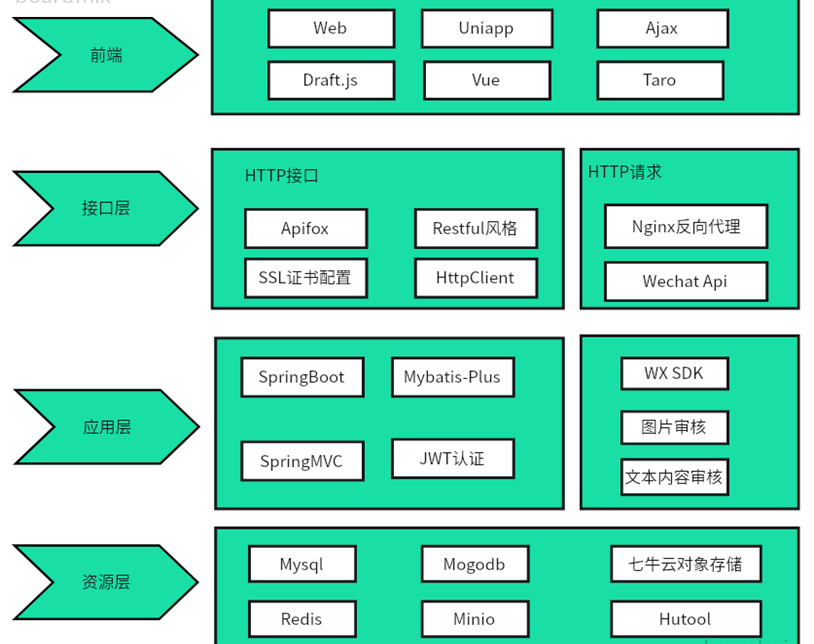
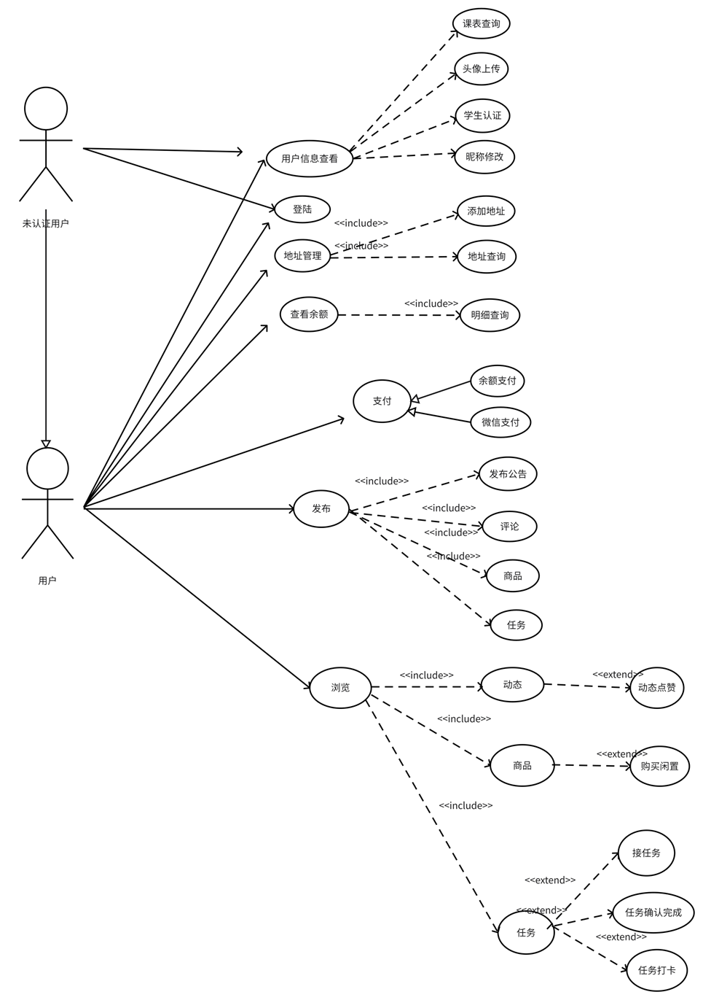
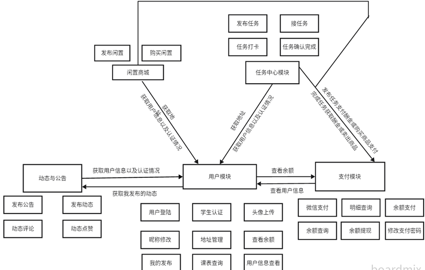
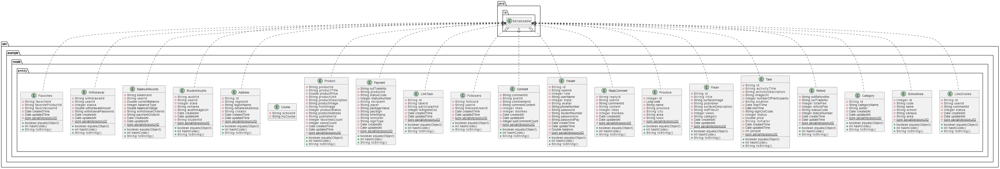

# 广小轻 Miniapp server

### 简述

目前市场上的主流校园小程序包括有料同学、百度贴吧(校园吧)、零点校园、叮点校园等。然而，这些应用存在诸多问题，如页面设计不够美观、广告泛滥、隐藏广告关闭按钮、功能少等。

例如，有料同学缺乏闲置商品交易功能，仅相当于一个贴吧，且其中充斥大量广告信息，甚至包含部分不良色情信息。上述竞品均缺乏课表查询功能、学时学分查询功能和学校官方公告展示功能，有的甚至包含非本校园的信息，导致校园信息数据混乱合并。

表 1-1 竞品比较表

|           | **小轻**(**本程序**) | **有料同学** | **百度贴吧** | **零点校园** | **叮点校园** |
|-----------|-----------------|----------|----------|----------|----------|
| **流畅度**   | P               | P        | P        | O        | O        |
| **广告**    | O               | P        | P        | P        | P        |
| **私有化部署** | P               | O        | O        | O        | O        |
| **信息安全**  | P               | P        | P        | O        | O        |
| **课表查询**  | P               | O        | O        | O        | O        |
| **闲置商品**  | P               | O        | O        | O        | O        |
| **官方公告**  | P               | O        | O        | O        | O        |
| **动态**    | P               | P        | P        | P        | P        |

### 演示:

**运行展示:**

[点击观看演示视频](https://nanfangshaonian.feishu.cn/file/VIGDbL68eo98dOxgroGcEjn4nHv?from=from_copylink)

### 项目亮点:

**安全性保障**：

- 数据库**权限控制**采用了多用户配置，细分权限，确保敏感数据仅限授权人员访问。
- 采用了**定期数据库备份**策略，通过 Shell 脚本实现，以应对意外数据丢失或损坏的情况。
- 支付密码采用了独立设置，并且使用了**Bcrypt 加密算法**，有效保障了用户支付信息的安全性。
- 微信支付限定支付时间，防止恶意操作,并且订单号采用**雪花算法**随机生成，防止订单号重复引起数据插入异常。
- 使用**AOP切面**加入**ip地址黑名单**机制以及**访问频率限制**，防止恶意访问,爬虫访问。
- 采取**HTTPS**协议,配置SSL证书,信息加密传输,防止数据在传输过程中被窃取或篡改。
- 采用**数据隔离**技术，支持**私有化部署**，数据存储在学校机房内，数据安全更有保障。各校数据**互不连通**，有效防止数据泄露和安全风险。

**订单管理和防止恶意操作**：

- 通过微信支付的查询订单(**轮询机制**)和回调 API 实现支付成功的**回调**功能，确保订单支付状态的及时更新。
- 引入**定时任务**和**异步任务**机制，系统自动取消未付款订单，防止恶意拍下拒绝付款情况的发生。

**任务中心的接单和任务完成机制**：

- 采取了**双方确认机制**，即在双方确认送达后即完成任务，保障了任务完成的**准确性和可靠性**。
- 为了确保任务完成情况，程序支持拍照上传功能，发布者可通过图片确认任务完成情况。

**图片渲染速度和程序响应速度优化**：

- 使用 Redis 缓存**高读取低修改**的数据，如 Token 信息和热门文章，减少了数据库的读取压力。
- 采用了对象存储的**策略模式**，混合使用两种对象存储，并利用 CDN 加速高延迟的存储，提高了图片渲染速度。
- 在小程序前端实现了懒加载，将部分缓存保存在用户手机上，减少了服务器请求次数，提升了程序响应速度。

**课程表数据保存的优化**：

- 采用了 MongoDB 非关系型数据库来保存课程表数据，解决了 JSON 格式在 MySQL 中存储的**耦合性和查询效率低的问题**。
- MongoDB 的 JSON 存储格式使得数据读取更为便捷，可根据键值对进行灵活的查询，大大提高了课程表数据的管理和查询效率。
- 采取**MogoDB文档模型**是因为这个课程表**主要的业务是读取**
  ,还有就是这个课程信息与学生信息并非关系模型,是文档模型,因为有的学生课程时间不一致,考量了性能以及业务需求,最终选择了文档模型的存储方式

**部署运维**

- **多环境部署支持**: 项目支持在不同环境（local、prod、docker）下的部署，使得应用能够灵活适配各种场景和需求,如开发环境、测试环境和生产环境。

- **Docker镜像化**: 通过提供的Dockerfile，项目能够轻松地构建Docker镜像，实现应用的快速部署和迁移。这种容器化的部署方式有效地提高了部署的灵活性和效率。

- **降低运维成本和操作难度**: 使用Docker简化了部署流程，降低了运维成本和操作难度。这意味着运维人员可以更容易地管理和维护应用，减少了出错的可能性，提高了运维效率。

这些措施不仅**提升了系统的安全性和稳定性**，还**优化了用户体验**，提高了系统的性能和响应速度，为项目的成功运行和用户满意度提供了坚实保障。

## 设计

### 应用架构设计

上图为本程序的应用架构图,如图所示主要用到的技术框架：

1. 数据库的**重要数据均已进行加密**，比如支付密码使用的是安全级别较高的**Bcrypt加密**，同时配置了SSL证书，**支持HTTPS**，安全性得到了一定的保障；
2. 存储数据使用了主流的数据库，**Mysql**作为存储关系型较强的信息，**Redis**用于保存缓存信息。由于发布时间较新的动态信息、部分用户的登陆状态信息等此类信息需要频繁读取，小程序的前端使用懒加载，提高了一定的性能；
3. 为了图片的响应速度得到保障，使用了**七牛云的对象存储**以及**CDN加速**，同时使用了**Minio对象存储**,**策略模式实现混合存储**；
3. 由于本项目是基于小程序的开发,为此**使用HttpClient调用微信的API**进行业务需求的书写;
4. 该小程序配置了后台管理系统(Web端)，使用**Nginx反向代理**进行系统的部署，同时配置了SSL证书；
5. 该项目是**前后端分离项目**，前端使用了**Ajax**进行发送请求，后端接口文档使用Apifox(类似于Swagger产品)；
6. 后端基于 SpringBoot进行项目的开发，使用基于 **ORM** 的框架**Mybatis-Plus**同时使用 **JWT** 作为身份认证，**提高了安全性以及性能**(
   JWT的好处是减少了服务器的压力，同时Token解密需要密钥)。

### 业务设计

特别说明:以下功能需在个人设置上进行学生认证(可以通过上传学生证或者输入学号以及密码进行验证)
，学校官方账号会分配一个专属的管理员账号,多个学校数据不共享。

如图所示 业务架构分为5个模块
程序的ULM用例图所示,小程序提供了一系列功能，为学生提供了便利和交流的平台：

1. **官方公告与动态专区**: 学校发布重要通知和公告，同时师生可以自由发布校内动态，实现信息传递与校园生活分享的双向互动，促进校园文化建设。

2. **二手闲置与任务中心**: 学生可以在平台上发布二手物品信息，实现资源再利用，同时可以发布校园活动、兼职等信息，促进勤工俭学，解决师生生活中的困难，形成校内资源共享的生态。

3. **课程表与学生认证**: 学生可以通过小程序方便地查看课表信息，而且通过学生证认证确保了二手闲置交易的安全性，增加了用户的信任度和安全感。

4. **余额与地址管理**: 小程序支持微信支付和收益提现，同时提供了余额详情查询功能，用户可以方便地管理自己的财务信息。地址管理功能也为用户提供了方便，节省了填写常用地址的时间。

5. **个人设置**: 用户可以自定义个人信息，包括昵称、头像等，还可以设置支付密码和进行学生认证，提升了用户体验和安全性。

### SQL设计:

上述是数据库的UML 类图,具体详细的信息请查看本目录的doc/sql文件夹里面的ER图和数据库脚本,推荐查看doc/设计与开发文档里面的产品文档,里面详细记载了从设计到开发的每一项步骤

### API设计:

**在线API文档** [点击查看](https://apifox.com/apidoc/shared-7a42976b-cc7d-4e4c-979f-b9fc95139fd3/api-109473737)

**离线查看**

- 本程序提供openapi文档文件,支持导入Postman,Apifox,Apipost等主流的调试工具,在doc/api文件夹下openapi文档文件
- 提供API规范说明以及接口说明文档,在doc/api文件夹下的API设计(规范以及接口说明)PDF文件

## Getting Started

### 传统环境下部署
#### 环境要求:
确保本机已经安装了JDK 20, MySQL 8.0.34, Redis 7.0.8, MongoDB 7.0, Minio 2022-04-16T04-26-02Z 
1. **初始化数据库**: 进入doc/sql文件夹,根据init.sql脚本文件导入数据库

2. 配置**application-local.yml**文件:
   1. **数据库配置**: 修改application-local.yml文件中的数据库配置,将数据库的url,username,password修改为你自己的数据库配置
   2. **Redis配置**: 修改application-local.yml文件中的redis配置,将redis的host,port,password修改为你自己的redis配置
   3. **Minio配置**: 修改application-local.yml文件中的minio配置,将minio的endpoint,accessKey,secretKey修改为你自己的minio配置
   4. **MogoDB配置**: 修改application-local.yml文件中的mongodb配置,将mongodb的host,port,username,password,database修改为你自己的mongodb配置

3. 配置**application.yml**文件:
   1. 修改微信支付成功回调地址(callback.success-address),此地址需要部署在公网服务器上的域名地址,example:https://example.com/wxpay/notify 此地址路径是程序控制器的路径,不要修改
   2. 修改微信支付退款回调地址(callback.refund-address),此地址需要部署在公网服务器上的域名地址,example:https://example.com/wxpay/refundNotify 此地址路径是程序控制器的路径,不要修改
   3. 选择环境 active local

4. **启动程序**: 启动程序,在项目根目录下执行`mvn spring-boot:run`命令,程序会自动启动
### 使用docker部署

1. **构建环境镜像**: 
   1. 进入doc/docker/evn 文件夹
   2. 执行`docker build -t evn:latest .`命令构建环境镜像,此镜像包含JDK 20, MySQL 8.0.34, Redis 7.0.8, MongoDB 7.0, Minio 2022-04-16T04-26-02Z
   
2. **构建程序镜像**:
   1. 如果域名回调地址不变情况下: 进入doc/docker/run 文件夹 执行`docker build -t run:latest .`命令构建程序镜像

   2. 如果域名回调地址改变情况下:
      1. 修改 **application.yml** 文件中的回调地址,将域名换成你的域名,并确保选择环境 active docker
      2. 执行`mvn -U clean package -Dmaven.test.skip=true`命令打包
      3. 将jar放入doc/docker/run 文件夹下(确保jar名称为 docker_local_https.jar)
   
   
3. **运行镜像**:
   1. 运行环境镜像 : `docker run -d -p 3306:3306 -p 6379:6379 -p 27017:27017 -p 9000:9000 --name evn evn:latest`
   2. 运行程序镜像: `docker run -d -p 443:443 --name run run:latest`